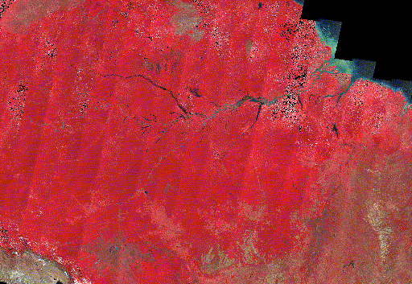

# Amazon Deforestation Timelapse (2000-2025)

A comprehensive Google Earth Engine project visualizing 25 years of Amazon rainforest deforestation using Landsat satellite imagery and false-color composites.



## 🌳 Overview

This project uses Google Earth Engine to process Landsat satellite imagery from 2000-2025, creating annual cloud-masked composites that reveal deforestation patterns in the Amazon rainforest. The visualization uses false-color RGB mapping where healthy vegetation appears bright red, while deforested areas appear gray/brown.

**Key Insight**: The timelapse clearly shows the progressive loss of forest cover, with major deforestation hotspots visible in Brazil (Rondônia, Pará) and along the Peru border.

## ✨ Features

- **25 Years of Data**: Comprehensive analysis from 2000 to 2025
- **Multi-Satellite Integration**: Combines Landsat 5, 7, and 8 data
- **Cloud Masking**: Advanced cloud removal for clear annual composites
- **False-Color Visualization**: NIR-based visualization highlighting vegetation health
- **Interactive Web Interface**: Clean, modern UI showcasing the timelapse
- **Export Ready**: Complete GEE script for video export

## 🚀 Quick Start

### 1. View the Visualization

Simply open `index.html` in your web browser to view the timelapse and project information.

### 2. Run in Google Earth Engine

1. Go to [Google Earth Engine Code Editor](https://code.earthengine.google.com/)
2. Sign in with your Google account
3. Copy the contents of `amazon_deforestation_timelapse.js`
4. Paste into the code editor
5. Click **Run**
6. Check the **Tasks** tab to export the video

For detailed export instructions, see [EXPORT_GUIDE.md](EXPORT_GUIDE.md)

## 📁 Project Structure

```
Satellite/
├── index.html                          # Main web interface
├── deforestation.gif                   # Timelapse visualization
├── amazon_deforestation_timelapse.js  # Google Earth Engine script
│
├── Documentation/
│   ├── README.md                       # Main documentation
│   ├── METHODOLOGY.md                  # Scientific methodology
│   ├── EXPORT_GUIDE.md                 # Step-by-step export guide
│   ├── analysis.md                     # Detailed analysis
│   └── VISUALIZATION_GUIDE.md         # False-color interpretation
│
├── Configuration/
│   ├── config.json                     # Main configuration file
│   ├── regions.json                    # Geographic region definitions
│   └── visualization-presets.json     # Visualization presets
│
├── Code/
│   ├── constants.js                    # Constants and configuration
│   └── utils.js                        # Utility functions
│
├── Scripts/
│   └── validate-config.js              # Configuration validator
│
└── Project Files/
    ├── package.json                    # Node.js project metadata
    ├── .gitignore                      # Git ignore rules
    ├── .eslintrc.json                  # ESLint configuration
    ├── .prettierrc.json                # Prettier configuration
```

## 🔬 Methodology

The project follows a systematic approach to satellite image processing:

1. **Data Collection**: Landsat 5 (2000-2011), Landsat 7 (2012), Landsat 8 (2013-2025)
2. **Cloud Masking**: QA_PIXEL band analysis to remove clouds and shadows
3. **Annual Composites**: Median composite per year to reduce noise
4. **False-Color Mapping**: NIR→Red, Red→Green, Green→Blue
5. **Temporal Analysis**: 26 annual frames combined into timelapse

For detailed methodology, see [METHODOLOGY.md](METHODOLOGY.md)

## 🎨 Visualization Guide

**What the colors mean:**
- **Bright Red**: Healthy, dense vegetation (strong NIR reflectance)
- **Dark Red/Brown**: Degraded or sparse vegetation
- **Gray/Brown**: Deforested areas, exposed soil, roads
- **Blue/Black**: Water bodies, shadows

For comprehensive interpretation guide, see [VISUALIZATION_GUIDE.md](VISUALIZATION_GUIDE.md)

## 📊 Results & Analysis

### Key Findings

- **Major Deforestation Hotspots**:
  - Rondônia, Brazil (2000-2010): Moderate clearing
  - Pará, Brazil (2010-2020): Rapid expansion due to agriculture
  - Peru Border (2020-2025): Ongoing deforestation

- **Patterns Observed**:
  - "Fishbone" road patterns indicating systematic clearing
  - Clear-cutting along rivers and roads
  - Expansion of agricultural areas

For detailed analysis, see [analysis.md](analysis.md)

## 🛠 Technical Details

### Configuration Files

The project includes several configuration files for easy customization:

- **`config.json`**: Main configuration (regions, temporal settings, export parameters)
- **`regions.json`**: Predefined geographic regions for different study areas
- **`visualization-presets.json`**: Different visualization styles
- **`constants.js`**: JavaScript constants for GEE script
- **`utils.js`**: Reusable utility functions

### Satellite Data
- **Landsat 5**: Collection 2, Tier 1, Level 2
- **Landsat 7**: Collection 2, Tier 1, Level 2
- **Landsat 8**: Collection 2, Tier 1, Level 2

### Processing Parameters
- **Region**: Amazon Rainforest bounding box (-74° to -44° W, -15° to 5° N)
- **Resolution**: 30 meters per pixel
- **Composite Method**: Annual median
- **Cloud Masking**: QA_PIXEL bit flags (bits 3 & 4)
- **Export Resolution**: 1920px width, 2 FPS

### False-Color Parameters
```javascript
bands: ['NIR', 'Red', 'Green']
min: [0.0, 0.0, 0.0]
max: [0.4, 0.3, 0.3]
gamma: [1.2, 1.2, 1.2]
```

### Customization

Edit `config.json` to change:
- Study region bounds
- Time range
- Export settings
- Visualization parameters

Use `regions.json` to quickly switch between different Amazon regions (Rondônia, Pará, etc.)

## 📋 Requirements

- **Google Earth Engine Account**: Free account at [earthengine.google.com](https://earthengine.google.com/)
- **Web Browser**: Modern browser for viewing the HTML interface
- **No Local Installation Required**: All processing happens in Google Earth Engine cloud

## 🙏 Acknowledgments

- **USGS/NASA**: For providing Landsat satellite data
- **Google Earth Engine**: For the powerful cloud computing platform
- **Landsat Program**: For continuous Earth observation since 1972

## 📚 Additional Resources

- [Google Earth Engine Documentation](https://developers.google.com/earth-engine)
- [Landsat Collection 2 Guide](https://www.usgs.gov/landsat-missions/landsat-collection-2)
- [False-Color Remote Sensing](https://www.usgs.gov/faqs/what-are-band-designations-landsat-satellites)

## 🔗 Related Projects

This project demonstrates:
- Large-scale satellite image processing
- Temporal analysis of environmental change
- False-color visualization techniques
- Google Earth Engine workflow automation

---

**Built with ❤️ using Google Earth Engine**

For questions or contributions, please refer to the methodology and export guides included in this repository.
